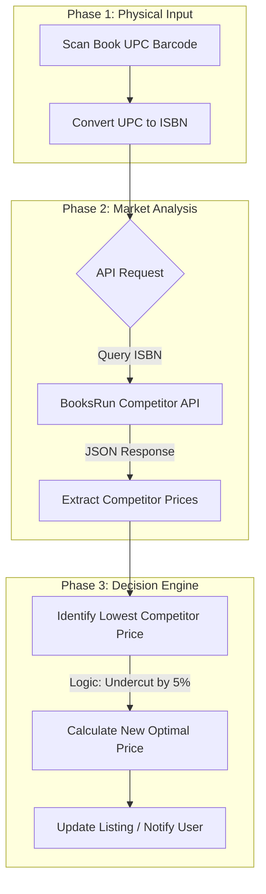

# Infosys Springboard Virtual Internship Project

**Author:** Snigdha Ghosh 


---

## Table of Contents
- [Project Overview](#project-overview)
- [Milestone 1: Project Infrastructure & Neural Networks](#milestone-1-project-infrastructure--neural-networks-from-scratch)
- [Milestone 2: Web Scraping & Data Aggregation](#milestone-2-web-scraping--data-aggregation)
- [Milestone 3: Sentiment Analysis & NLP](#milestone-3-sentiment-analysis--customer-review-processing)
- [Milestone 4: Cross-Platform Integration & Automation](#milestone-4-cross-platform-integration--notification-system)
- [Conclusion](#conclusion)

---

## Project Overview

Welcome to the comprehensive technical documentation of my Infosys Springboard Virtual Internship project. This initiative was designed to simulate a real-world Full Stack Data Science pipeline, starting from raw model creation and moving up to complex system integration and automation.

> [!IMPORTANT]
> **Development Environment Specification**  
> All development was conducted on **Google Colab**, utilizing its **NVIDIA GPU (CUDA)** runtime to accelerate training processes.
> *   **Deep Learning:** leveraged TensorFlow/Keras and PyTorch.
> *   **Automation:** utilized `asyncio` loop handling to run **Playwright** within the Colab notebook environment (`nest_asyncio.apply()`).

---

## Milestone 1: Project Infrastructure & Neural Networks from Scratch

**Objective:** To demonstrate a fundamental understanding of Deep Learning architectures by building, compiling, and training models on the **MNIST Handwritten Digit Dataset** (28x28 grayscale images).

### 1. Deep Neural Network (DNN) Architecture
I implemented a Multi-Layer Perceptron (MLP) aimed at understanding dense layer interactions.

*   **Optimizer:** `RMSprop` (Root Mean Square Propagation)
*   **Metrics:** Accuracy

<details>
<summary><b>Detailed Layer Configuration (Click to Expand)</b></summary>

```python
model = Sequential([
    Flatten(input_shape=(28, 28)),
    # Hidden Layer 1: High capacity for feature mapping
    Dense(128, activation='sigmoid'),
    # Hidden Layer 2: Bottleneck layer to compress features
    Dense(64, activation='sigmoid'),
    # Output Layer: Probabilities for digits 0-9
    Dense(10, activation='softmax')
])
```
</details>

### 2. Convolutional Neural Network (CNN) Architecture
I upgraded to a CNN to leverage spatial hierarchies in image data, significantly improving accuracy.

*   **Optimizer:** `Adam` (Adaptive Moment Estimation)
*   **Batch Normalization:** Applied after convolutions to stabilize learning.


---

## Milestone 2: Web Scraping & Data Aggregation

**Objective:** To engineer a robust, automated scraping agent capable of navigating dynamic e-commerce websites and extracting structured product data.

**Target Domain:** [WebScraper E-Commerce Sandbox](https://webscraper.io/test-sites/e-commerce/static/computers/laptops)

### Technical Implementation

I utilized **Playwright's Async API** to handle JavaScript-heavy content and dynamic pagination.

#### 1. Dynamic Pagination Logic
The script automatically detects the total page count by analyzing the `.pagination` elements and iterates through them.

```python
# Logic to construct dynamic URLs for reliable pagination
if "?" in cat['url']:
    page_url = f"{cat['url']}&page={i}"
else:
    page_url = f"{cat['url']}?page={i}"

await page.goto(page_url)
```

#### 2. Robust Element Selection
I employed specific CSS selectors to target data points precisely, using error handling to manage missing fields.

| Data Point | CSS Selector Used | Transformation Logic |
| :--- | :--- | :--- |
| **Title** | `.thumbnail .title` | Extract text & strip whitespace |
| **Price** | `.thumbnail .price` | Extract text (e.g., "$1200") |
| **Rating** | `.ratings .glyphicon-star` | Count elements (`len(stars)`) |
| **Description** | `.thumbnail .description` | Extract full text |

#### 3. Sub-Category Navigation
The script intelligently expands side menus (e.g., clicking "Computers" to reveal "Laptops") using `page.click()` and `page.wait_for_selector()`.

---

## Milestone 3: Sentiment Analysis & Customer Review Processing

**Objective:** To operationalize unstructured text data. I built a pipeline that transforms qualitative data (reviews/news) into quantitative metrics (sentiment scores) to drive business decisions.

### AI Engine Specification
I integrated the **Hugging Face `transformers`** library to deploy state-of-the-art NLP models globally.

*   **Library:** `transformers`
*   **Task:** `question-answering` and `sentiment-analysis`
*   **Model Architecture:** `distilbert-base-cased-distilled-squad` (optimized for speed and accuracy).

### The "Sentiment-to-Price" Algorithm
I devised a logic gate that adjusts product pricing based on the aggregated sentiment score of recent news and reviews.

> [!TIP]
> **Algorithm Logic:**
> 1.  **Input:** Stream of text (News Headlines / Product Reviews).
> 2.  **Processing:** Model returns a label (`POSITIVE` / `NEGATIVE`) and a confidence score.
> 3.  **Action:**
>     *   If **Positive**: Demand is predicted to rise. **Action:** Increase Price marginally to maximize margin.
>     *   If **Negative**: Demand is predicted to fall. **Action:** Decrease Price to stimulate sales volume.

---

## Milestone 4: Cross-Platform Integration & Notification System

**Objective:** To demonstrate a complete "Scan-to-Shelf" automation pipeline. This milestone integrates physical world inputs with digital API data to automate decision-making.

### End-to-End Pipeline



### Key Technical Components
1.  **UPC/ISBN Conversion:** Implemented algorithms to translate standard 12-digit UPCs into the 13-digit ISBN format required by book APIs.
2.  **API Integration:** Used Python's `requests` library to fetch real-time JSON data from the **BooksRun API**.
3.  **Competitive Logic:** The system parses the JSON response, filters for "New" condition books, identifies the minimum price, and automatically calculates a competitive undercutting price.

---

## Conclusion

This project stands as a testament to the power of modern Data Science and Automation pipelines. By connecting disjointed technologies—**Neural Networks** for recognition, **Playwright** for data gathering, **Transformers** for understanding, and **APIs** for integration—I have built a cohesive system that mimics the sophisticated automation stacks found in top-tier tech companies.

---
*© 2026 Snigdha Ghosh | Infosys Springboard Virtual Internship*
